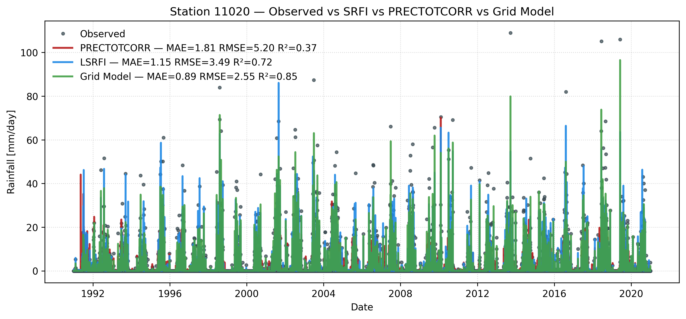

# Summary  

Daily climate station records underpin hydrological design, agricultural planning, and climate-risk assessment, yet long observational series are almost always affected by missing data, station relocations, and inconsistent maintenance [@Menne2012]. In México, the national network maintained by the Servicio Meteorológico Nacional (SMN) includes thousands of stations with heterogeneous record length and completeness, complicating nationwide analyses and the calibration of gridded climate products [@CONAGUA2012SMN135].

**MEXsrfdcrPy** is a Python package designed to address this challenge by training a **single global random forest model** on all available daily observations using only geographic coordinates and calendar information—latitude, longitude, elevation, and time. The trained model is then used to reconstruct missing station values, quantify spatial interpolation skill at individual stations, and generate daily climate grids at user-defined resolutions. The same workflow applies to daily precipitation, minimum and maximum temperature, and evaporation.

The package builds on NumPy, pandas, and scikit-learn [@Harris2020; @McKinney2010; @Pedregosa2011] and is intended for use in interactive notebooks, scripted workflows, and large-scale batch processing. MEXsrfdcrPy provides the spatial interpolation component, with calendar-based temporal features, within a broader open-source ecosystem for Mexican climate data that also includes tools for station data access and local spatial–temporal imputation [@Antonio-Fernandez_2025_SMNdataR; @Antonio-Fernandez2025_MissClimatePy].

# Statement of need  

Spatial interpolation of climate station data is traditionally performed using kriging, inverse distance weighting, or spline-based methods [@Hijmans2005; @Hofstra2008]. While effective, these approaches often require explicit covariance modeling and variable-specific configuration. In contrast, machine-learning methods—particularly random forests—have gained popularity for spatial prediction because they capture nonlinear relationships without strong distributional assumptions [@Breiman2001; @Hengl2018]. Many existing implementations, however, depend on auxiliary predictors that are unavailable for long historical periods or at all station locations.

MEXsrfdcrPy targets a complementary use case: **reconstructing daily station series and generating gridded fields using only coordinates and time**. The package assumes that a substantial portion of the climatological signal can be learned from latitude, longitude, elevation, and day of year when training data aggregate decades of observations from a dense national network. This design avoids reliance on external reanalysis or remote-sensing products, simplifies deployment across variables and periods, and enables the creation of reusable global models that can be archived and shared. The approach is well suited to national and regional studies requiring transparent reconstruction of long daily series for applications such as crop modeling, drought analysis, and climate-change assessment [@Ruane2015AgMERRA; @Xu2024DeepLearningClimate].

# Model and implementation  

MEXsrfdcrPy operates on a long-format daily dataset containing station identifier, date, latitude, longitude, elevation, and a single numeric target variable. Time is represented through year, month, and day of year, with optional sinusoidal terms to capture the annual cycle. A single `RandomForestRegressor` [@Breiman2001; @Pedregosa2011] is trained using all stations that exceed a user-defined threshold of valid observations within a specified training window. The fitted model and associated metadata—feature set, training period, and station coverage—are stored as joblib and JSON artifacts to support reproducibility.

The package is organized around two high-level modules. The **`loso`** module implements leave-one-station-out (LOSO) experiments in which each station is excluded from training and then predicted over the evaluation period. Model performance is summarized using mean absolute error (MAE), root mean squared error (RMSE), and the coefficient of determination (R²), computed on daily values and optional temporal aggregations following recommended practices for spatial cross-validation [@Roberts2017]. The **`grid`** module reuses a trained global model to generate predictions on arbitrary station sets or regular spatial meshes defined by latitude, longitude, and elevation.

# Software Design  

MEXsrfdcrPy follows a modular design that separates data preparation, model training, evaluation, and spatial prediction. Core functionality is built around scikit-learn estimators, enabling extensibility and transparent reuse across climate variables and spatial domains. The design emphasizes reproducibility, minimal dependencies, and straightforward integration into existing Python-based climate analysis workflows.

# Examples  

The package is demonstrated using a 1991–2020 SMN daily dataset for México [@AntonioFernandez2025SMN]. A typical analysis first performs LOSO experiments to quantify station-level interpolation skill and then trains a global model on the full network to generate continuous daily fields on a fine spatial grid.

@fig-station11020 presents a representative station-level comparison produced with the built-in plotting utilities. Daily rainfall observations are contrasted with an external gridded product from NASA POWER (PRECTOTCORR) [@NASA2020POWER], a local spatial–temporal random forest model obtained with MissClimatePy [@Antonio-Fernandez2025_MissClimatePy], and a grid-based global model derived from MEXsrfdcrPy. The comparison illustrates that the global spatial random forest can achieve competitive or superior performance relative to alternative data sources at individual stations.

{#fig-station11020}

# Research Impact Statement  

MEXsrfdcrPy enables transparent reconstruction and spatial interpolation of daily climate records from incomplete station networks. By relying only on geographic coordinates and time, it lowers barriers to reproducible climate analysis and supports applications in hydrology, agriculture, drought monitoring, and climate-change research at national and regional scales.

# AI Usage Disclosure  

This software employs classical machine-learning methods, specifically random forest regression, for spatial prediction. No generative artificial intelligence models were used in the development, training, or evaluation of the scientific results produced by this software.

# Acknowledgements  

This work was supported by the Secretaría de Ciencia, Humanidades, Tecnología e Innovación (SECIHTI) through a doctoral scholarship to the first author. We acknowledge Colegio de Postgraduados and Universidad Mexiquense del Bicentenario for institutional support, and CIMMYT for fostering collaboration in open climate and agricultural research.

# References

